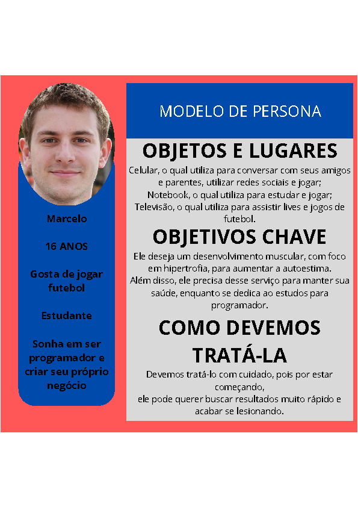
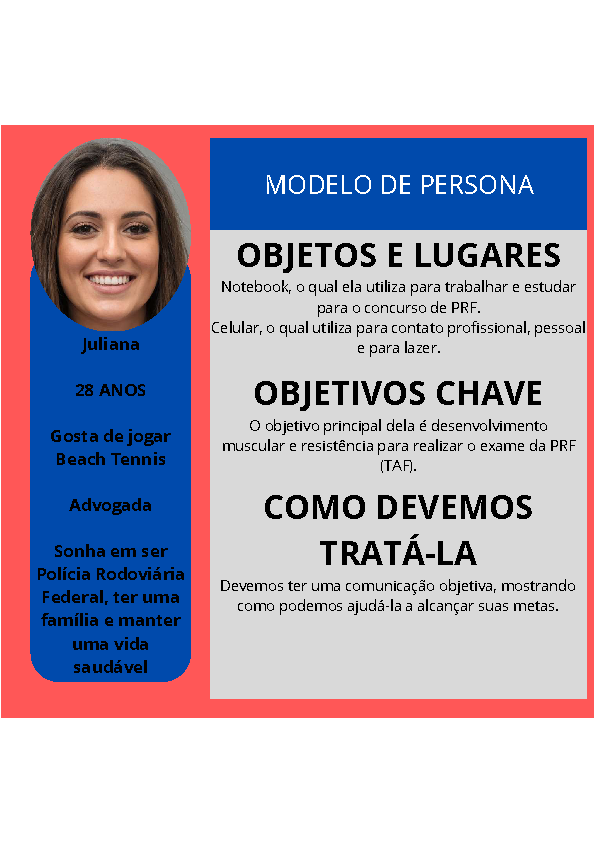
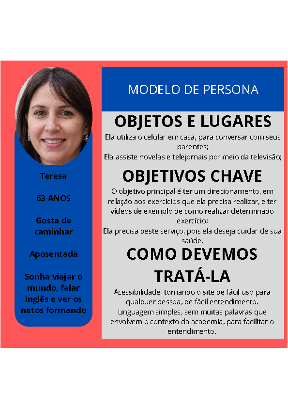
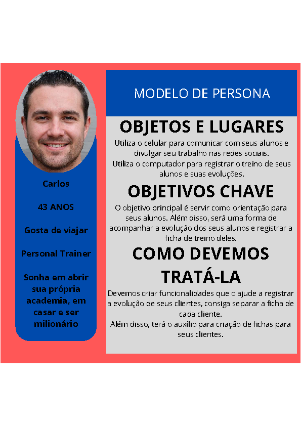
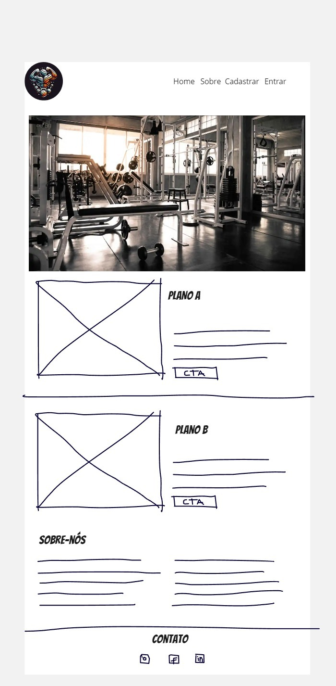
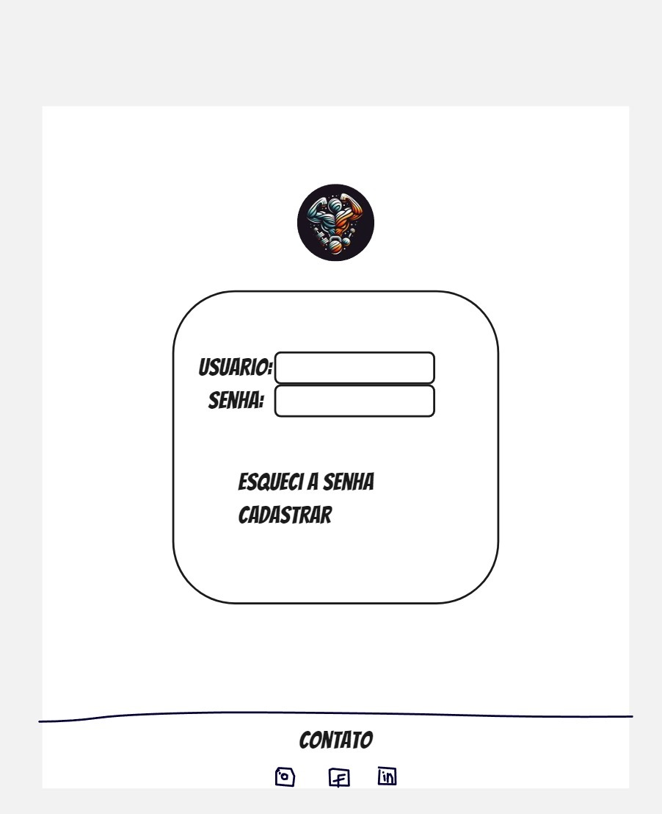
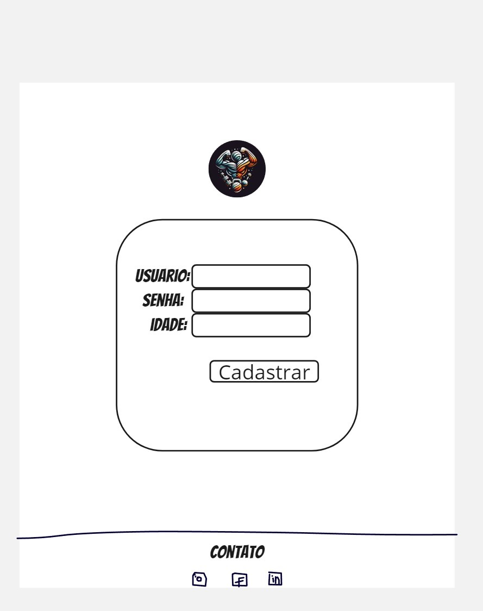
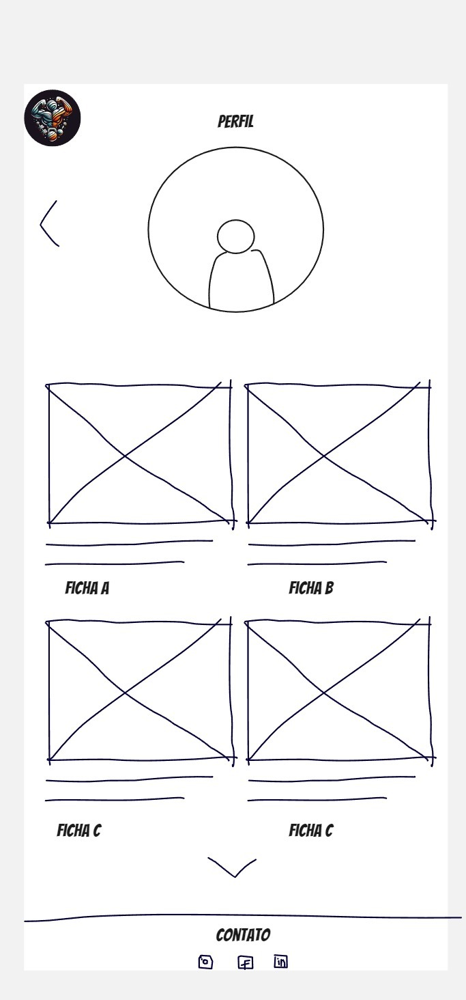
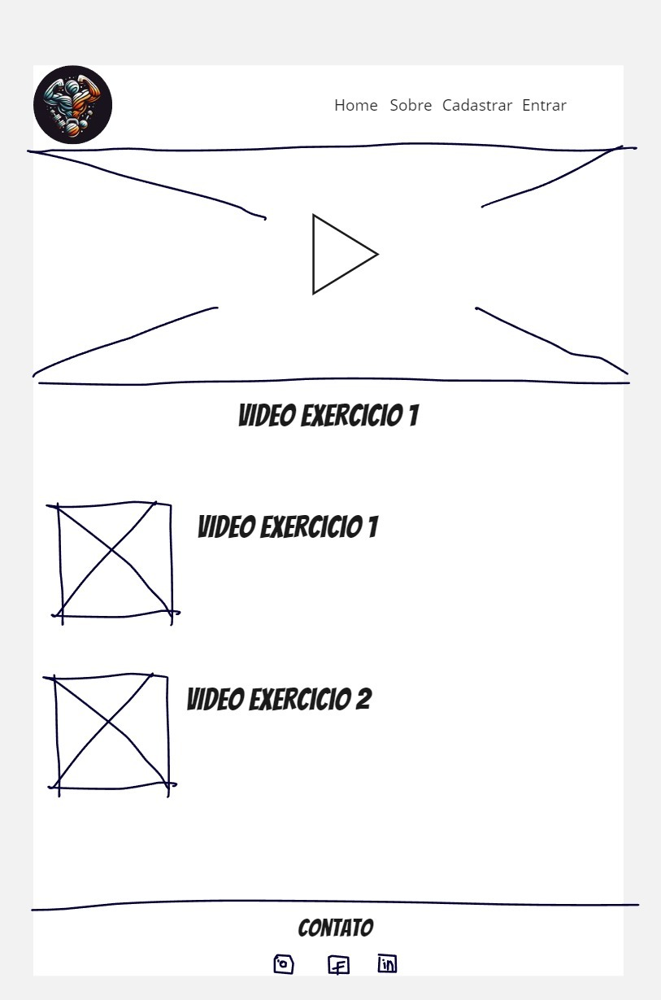
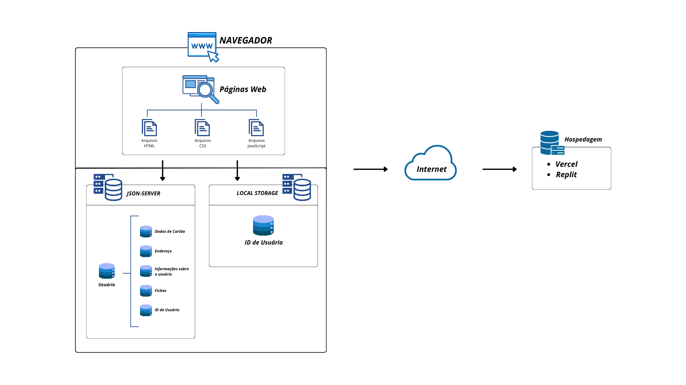

# Informações do Projeto
`TÍTULO DO PROJETO`  

O Básico Bem Feito 

`CURSO` 

Engenharia de Software 

## Participantes

 Inclua a lista dos membros da equipe com seus nomes completos.

 Os membros do grupo são: 
- Alexandre Augusto Bittencourt Munaier
- Breno Alves de Almeida
- Felipe Augusto Pereira de Sousa
- Gabriel Reis
- Guilherme de Almeida Rocha Vieira
- Miguel Mello Cabral

# Estrutura do Documento

- [Informações do Projeto](#informações-do-projeto)
  - [Participantes](#participantes)
- [Estrutura do Documento](#estrutura-do-documento)
- [Introdução](#introdução)
  - [Problema](#problema)
  - [Objetivos](#objetivos)
  - [Justificativa](#justificativa)
  - [Público-Alvo](#público-alvo)
- [Especificações do Projeto](#especificações-do-projeto)
  - [Personas e Mapas de Empatia](#personas-e-mapas-de-empatia)
  - [Histórias de Usuários](#histórias-de-usuários)
  - [Requisitos](#requisitos)
    - [Requisitos Funcionais](#requisitos-funcionais)
    - [Requisitos não Funcionais](#requisitos-não-funcionais)
  - [Restrições](#restrições)
- [Projeto de Interface](#projeto-de-interface)
  - [User Flow](#user-flow)
  - [Wireframes](#wireframes)
- [Metodologia](#metodologia)
  - [Divisão de Papéis](#divisão-de-papéis)
  - [Ferramentas](#ferramentas)
  - [Controle de Versão](#controle-de-versão)
- [**############## SPRINT 1 ACABA AQUI #############**](#-sprint-1-acaba-aqui-)
- [Projeto da Solução](#projeto-da-solução)
  - [Tecnologias Utilizadas](#tecnologias-utilizadas)
  - [Arquitetura da solução](#arquitetura-da-solução)
- [Avaliação da Aplicação](#avaliação-da-aplicação)
  - [Plano de Testes](#plano-de-testes)
  - [Ferramentas de Testes (Opcional)](#ferramentas-de-testes-opcional)
  - [Registros de Testes](#registros-de-testes)
- [Referências](#referências)

# Introdução

## Problema

Acompanhar sua evolução na academia e ter fichas personalizadas para seu objetivo, dando atenção para condições individuais das pessoas, é um problema para quase todas as pessoas que gostam de treinar! Desde pessoas que estão começando até pessoas mais experientes e personal trainers sofrem com esse problema.
Por esse motivo, decidimos criar uma solução em um único site.

## Objetivos

Nosso objetivo, portanto, é criar um sistema que auxilie desde iniciantes na academia até pessoas mais experientes ou até mesmo personal trainers, com um site acessível para todas as pessoas, com dicas de suplementação, notícias de última hora do mundo da musculação, vídeos demonstrando como executar os exercícios de forma correta, sistema de progressão, ou seja, o cliente consegue ver como está evoluindo. Resumindo, nosso sistema é voltado para o usuário, considerando todas as suas condições, sejam físicas ou financeiras. 

## Justificativa

A implementação de um site para gerenciamento inteligente de fichas de    academia trará diversos benefícios para a academia, seus alunos e a equipe.
Oferecer aos alunos uma experiência mais prática, segura, personalizada e eficiente, aumentando a sua satisfação e fidelidade.        

## Público-Alvo

 Nosso público-alvo abrange todas as pessoas a partir de 16 anos de idade, uma vez que recomendamos a supervisão de um profissional presencial para menores dessa faixa etária. 
 Isso envolve pessoas inexperientes, que desejam começar sua trajetória a uma vida mais saudável, pessoas experientes, que buscam maximizar seus resultados, com fichas preparadas especificamente para cada um. Ou até mesmo, profissionais, como personal trainers, que podem utilizar o sistema para acompanhamento e registro da evolução de seus clientes.

# Especificações do Projeto

Essa parte do projeto, inicia-se com a criação de Personas para compreender as necessidades dos usuários, seguido pela criação das Histórias de Usuários que descrevem suas necessidades. Os Requisitos Funcionais e Não Funcionais são definidos com base nessas histórias, garantindo que o software ofereça funcionalidades essenciais e atenda a requisitos técnicos importantes, como responsividade e suporte. Essas especificações direcionam o desenvolvimento do sistema, visando uma experiência satisfatória e eficiente para os usuários finais.

## Personas e Mapas de Empatia

## Histórias de Usuários

Com base na análise das personas forma identificadas as seguintes histórias de usuários:

|EU COMO... `PERSONA`| QUERO/PRECISO ... `FUNCIONALIDADE` |PARA ... `MOTIVO/VALOR`                 |
|--------------------|------------------------------------|----------------------------------------|
|Personal Trainer  | Gerenciar as fichas e evolução dos clientes | Ter maior controle no acompanhamento dos alunos               |
|Iniciante       | As melhores formas de orientação                | Para guiar minha trajetória e permitir maior evolução |
|Experiente       | De fichas mais complexas e individualizadas                | Para maximizar os meus resultados |
|Idoso       | De um site de fácil uso e com vídeos ensinando a execução                | Para evitar lesões e poder cuidar da minha saúde|

## Requisitos

As tabelas que se seguem apresentam os requisitos funcionais e não funcionais que detalham o escopo do projeto.

### Requisitos Funcionais

|ID    | Descrição do Requisito  | Prioridade |
|------|-----------------------------------------|----|
|RF-001| Cadastro e login de usuário  | ALTA | 
|RF-002| Especificações do usuário(condições físicas, necessidades e objetivos)   | ALTA |
|RF-003| Área de pagamento   | ALTA |
|RF-004| Ferramentas visuais para analisar o progresso ao longo do tempo   | ALTA |
|RF-005| Adicionar e editar exercícios, séries, repetições e pesos nas fichas de treino.   | ALTA |
|RF-006| Visualizar a Divisão de Fichas   | MÉDIA |
|RF-007| Notícias: guias e dicas   | BAIXA |
|RF-008| Guias e tutoriais de cada exercício   | MÉDIA |
|RF-009| Apresentação de Informações do Usuário  | MÉDIA |
|RF-010| Apresentação das Especificações do Usuário   | MÉDIA |
|RF-011| Apresentação de Dados de Pagamento | MÉDIA |
|RF-012| Apresentação de Dados de Endereço   | MÉDIA |

### Requisitos não Funcionais

|ID     | Descrição do Requisito  |Prioridade |
|-------|-------------------------|----|
|RNF-001| Responsividade e Interação simples em dispositivos móveis | ALTA | 
|RNF-002| Termos de uso |  BAIXA | 
|RNF-003| Suporte  |  BAIXA | 

## Restrições

O projeto está restrito pelos itens apresentados na tabela a seguir.

|ID| Restrição                                             |
|--|-------------------------------------------------------|
|01| O projeto deverá ser entregue até o final do semestre |
|02| Não pode ser desenvolvido um módulo de backend        |

# Projeto de Interface

Nosso projeto foi desenvolvido seguindo as interfaces do UserFlow e do Protótipo Interativo, para criar com maior fidelidade, o projeto esperado. Tais interfaces foram elaboradas de forma a priorizar os requisitos de alta prioridade, que permitiria o funcionamento do site desde o início do projeto, para que assim, pudesse ir sendo testado, levando em consideração, os requisitos não funcionais do projeto. 

## User Flow

>

## Wireframes

Tela Inicial - Landing Page - para atrair novos clientes

Tela de Login, para os clientes que já possuem conta poderem acessar suas fichas.

Para aqueles clientes que tiveram interesse, para criarem sua conta e poderem ter acesso ao sistema.

Tela onde aparece as fichas do usuário, para que ele possa ter acesso a elas.

Tela onde aparece os guias e tutoriais de cada exercício, para que o cliente possa executá-los corretamente.

Tela onde aparece diversas dicas e notícias atuais, para que o usuário se mantenha informado da comunidade do mundo da academia.
[Dicas-Notícias](images/Dicas-Noticias.jpg)
Tela onde o usuário pode contatar um de nossos membros da equipe para tirar dúvidas.
[Suporte](images/Suporte.jpg)

# Metodologia

A divisão da implementação foi feita a partir de pastas individuais, separando as partes de cada membro da equipe.
Além disso, usufruimos do Framework Scrum, fazendo reuniões para buscarmos melhorar o desenvolvimento do projeto e solucionar problemas de implementação de cada um. 

## Divisão de Papéis

Através do Kanban, organizamos a separação de tarefas para cada um, também estabelecemos um tempo para apresentar à equipe antes de entregar tudo para garantir que todos concordem e que não tenha erros.

## Ferramentas

| Ambiente  | Plataforma              |Link de Acesso |
|-----------|-------------------------|---------------|
|Processo de Design Thinkgin  | Miro |  https://miro.com/app/board/uXjVKetZNjQ=/ | 
|Repositório de código | GitHub | https://github.com/ICEI-PUC-Minas-PMGES-TI/pmg-es-2024-1-ti1-2010100-o-basico-bem-beito | 
|Hospedagem do site | Heroku |  https://XXXXXXX.herokuapp.com | 
|Wireframe | Miro |  https://miro.com/app/board/uXjVKUAM62w=/ |
|User Flow | Figma |  https://www.figma.com/file/Y4xWIP2VusqpWXh4bIhcKN/useflow-(Community)?type=whiteboard&node-id=0-1&t=QLS6zuYjABgXiiIJ-0 |
|Protótipo Interativo | Figma | https://www.figma.com/file/E4wfQ2iBcoJQx8LAKItX4p/Protótipo-Interativo?type=design&node-id=0-1&mode=design&t=IChhaM5GYHOSjwd8-0 | 
|Editor de Código | Visual Studio Code | ------

## Controle de Versão

A ferramenta de controle de versão adotada no projeto foi o [Git](https://git-scm.com/), sendo que o [Github](https://github.com) foi utilizado para hospedagem do repositório `upstream`.

# Projeto da Solução

  Este projeto de software visa desenvolver uma plataforma inovadora de treinamento personalizado, focada em promover o bem-estar físico e mental dos usuários através de programas de treinamento adaptáveis e acompanhamento contínuo. A plataforma permitirá criar fichas personalizadas, monitorar o progresso dos usuários e oferecer suporte especializado. Portanto, buscamos democratizar o acesso a treinamentos de qualidade, tornando-os acessíveis a todos, independentemente de sua localização ou nível de experiência.

## Tecnologias Utilizadas

Para o desenvolvimento do Site, foram utilizadas diversas tecnologias para resolver os problemas.
Entre elas, temos:
Linguagens:
* HTML
* CSS
* JavaScript

Frameworks:
* Bootstrap
* Scrum

Bibiliotecas:
* JSON Server

IDE de desenvolvimento:
* Visual Studio Code

Ferramentas
* GitHub
* Figma
* Canvas

## Arquitetura da solução

;

# Avaliação da Aplicação

## Cenários de Teste da Aplicação

Para garantir que todos os requisitos funcionais sejam satisfeitos, apresentamos os seguintes cenários de testes detalhados:

## RF-001: Cadastro e login de usuário

### Cenário 1: Cadastro de novo usuário
- **Dado**: O usuário está na página de cadastro
- **Quando**: O usuário insere todos os dados válidos (nome, e-mail, senha, etc.) e clica em "Cadastrar"
- **Então**: Uma conta deve ser criada e uma mensagem de sucesso deve ser exibida

### Cenário 2: Login de usuário existente
- **Dado**: O usuário está na página de login
- **Quando**: O usuário insere um e-mail e senha válidos e clica em "Entrar"
- **Então**: O usuário deve ser autenticado e redirecionado para a página inicial

## RF-002: Especificações do usuário (condições físicas, necessidades e objetivos)

### Cenário 1: Adicionar especificações do usuário
- **Dado**: O usuário está autenticado e na página de especificações
- **Quando**: O usuário insere suas condições físicas, necessidades e objetivos e clica em "Finalizar"
- **Então**: As especificações devem ser salvas no json-server e uma mensagem de confirmação deve ser exibida

## RF-003: Área de pagamento

### Cenário 1: Adicionar dados de pagamento
- **Dado**: O usuário está na página de pagamento
- **Quando**: O usuário insere os dados do cartão de crédito, dados complementares de endereço, e escolhe um dos três planos existentes e clica em "Confirmar"
- **Então**: Os dados devem ser salvos com segurança e uma mensagem de confirmação deve ser exibida

## RF-004: Ferramentas visuais para analisar o progresso ao longo do tempo

### Cenário 1: Visualizar progresso
- **Dado**: O usuário está na página de progresso
- **Quando**: O usuário seleciona um intervalo clica em "Visualizar"
- **Então**: Um gráfico com o progresso do usuário deve ser exibido

## RF-005: Adicionar e editar exercícios, séries e repetições nas fichas de treino

### Cenário 1: Adicionar exercício a uma ficha de treino
- **Dado**: O usuário está na página de edição de ficha de treino
- **Quando**: O usuário insere os detalhes do exercício (nome, séries, repetições, intervalo) e clica em "Salvar"
- **Então**: O exercício deve ser adicionado à ficha de treino e exibido na lista

### Cenário 2: Editar um exercício existente
- **Dado**: O usuário está na página de edição de ficha de treino
- **Quando**: O usuário edita os detalhes de um exercício existente e clica em "Salvar"
- **Então**: As alterações devem ser salvas e exibidas na lista de exercícios

## RF-006: Visualizar a Divisão de Fichas

### Cenário 1: Visualizar fichas de treino
- **Dado**: O usuário está na página principal de fichas de treino
- **Quando**: O usuário acessa a página
- **Então**: Todas as fichas de treino do usuário devem ser exibidas

## RF-007: Notícias: guias e dicas

### Cenário 1: Visualizar notícias
- **Dado**: O usuário está na página de notícias
- **Quando**: O usuário acessa a página
- **Então**: As últimas notícias, guias e dicas devem ser exibidas

## RF-008: Guias e tutoriais de cada exercício

### Cenário 1: Acessar tutorial de um exercício
- **Dado**: O usuário está na página de detalhes de um exercício
- **Quando**: O usuário clica no exercício desejado
- **Então**: Um vídeo tutorial ou guia do exercício deve ser exibido

## RF-009: Apresentação de Informações do Usuário

### Cenário 1: Visualizar informações do usuário
- **Dado**: O usuário está na página de perfil
- **Quando**: O usuário acessa a página
- **Então**: As informações do usuário (nome, e-mail, etc.) devem ser exibidas

## RF-010: Apresentação das Especificações do Usuário

### Cenário 1: Visualizar especificações do usuário
- **Dado**: O usuário está na página de especificações
- **Quando**: O usuário acessa a página
- **Então**: As especificações (condições físicas, necessidades, objetivos, etc.) devem ser exibidas

## RF-011: Apresentação de Dados de Pagamento

### Cenário 1: Visualizar dados de pagamento
- **Dado**: O usuário está na página de pagamento
- **Quando**: O usuário acessa a página
- **Então**: Os dados de pagamento do usuário devem ser exibidos

## RF-012: Apresentação de Dados de Endereço

### Cenário 1: Visualizar dados de endereço
- **Dado**: O usuário está na página de endereço
- **Quando**: O usuário acessa a página
- **Então**: Os endereços do usuário devem ser exibidos

Estes cenários de testes garantem que os requisitos funcionais da aplicação sejam atendidos e ajudam a validar as funcionalidades implementadas.

## Registros de Testes

Os testes realizados revelaram pontos fortes significativos, especialmente nos processos de cadastros de informação e na gestão das informações do usuário. O fluxo de cadastro funcionou conforme esperado, com a validação dos dados preenchidos e criação bem sucedida das contas dos usuários na plataforma, garantindo a integridade das informações registradas, mesmo que o usuário se desconecte.

Por outro lado, foram identificados aspectos a serem melhorados, como pequenos desafios na edição das fichas de treino, como problemas referentes ao id dessas fichas. Além disso, houve alguns pontos a serem refinados na pesquisa de tutoriais, visando proporcionar uma navegação mais intuitiva e eficiente para os usuários acessarem.

Para melhorar, revisamos o tratamento com os códigos javascript das áreas identificadas, e se as informações estavam sendo armazenada corretamente no json-server, buscando garantir uma experiência contínua e satisfatória para todos os usuários.

# Referências

- https://www.w3schools.com/
- https://developer.mozilla.org/pt-BR/
- https://pt.stackoverflow.com/
- https://www.canva.com
- https://fontawesome.com/icons
- https://getbootstrap.com
- https://pixabay.com/pt/
- https://codepen.io

